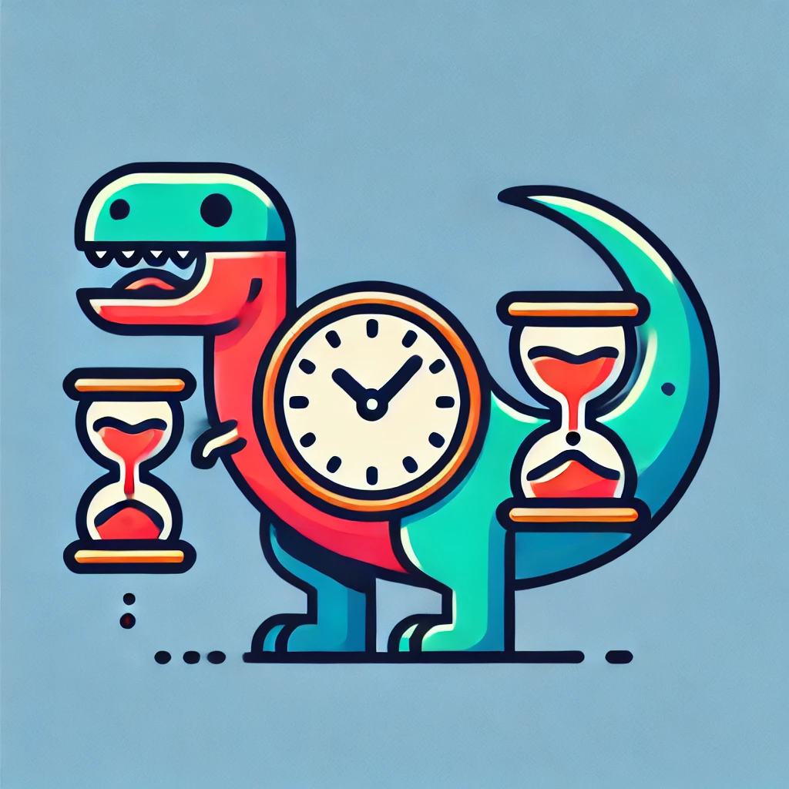

# Nikolai Nobadi
I’m an iOS developer passionate about creating efficient, modular apps that are easy to scale and maintain. I prioritize readability and always aim to make future modifications straightforward, which is much easier with a robust test suite. The guiding question I ask myself is: "Will I understand this code in 5 months without having to spend more than a few minutes reviewing it?". If the answer is no, it's time to refactor.

As a personal challenge, I'm currently in the process of making specific modules from my App Store apps public to showcase the modularity and structure of my work.

### 🛠️ Languages & Tools


<br />
<br />

---

###  Available on the App **Store**

<p>
    <a href="https://apps.apple.com/app/icleanme/id1350310256">
        <div style="width: 100px; height: 100px; border-radius: 12px; overflow: hidden; display: inline-block; margin-bottom: 20px; margin-right: 20px;">
            
        </div>
    </a>
    <a href="https://apps.apple.com/us/app/igetgroceries/id1578530983">
        <div style="width: 100px; height: 100px; border-radius: 12px; overflow: hidden; display: inline-block; margin-bottom: 20px; margin-right: 20px;">
            
        </div>
    </a>
    <a href="https://apps.apple.com/app/ioweyou-debt-tracker/id6450847298">
        <div style="width: 100px; height: 100px; border-radius: 12px; overflow: hidden; display: inline-block; margin-bottom: 20px; margin-right: 20px;">
            
        </div>
    </a>
    <a href="https://apps.apple.com/us/app/iaddthree/id1389962750">
        <div style="width: 100px; height: 100px; border-radius: 12px; overflow: hidden; display: inline-block; margin-bottom: 20px; margin-right: 20px;">
            
        </div>
    </a>
    <a href="https://apps.apple.com/us/app/codepurge/id6740788205?mt=12">
        <div style="width: 100px; height: 100px; border-radius: 12px; overflow: hidden; display: inline-block; margin-bottom: 20px; margin-right: 20px;">
            
        </div>
    </a>
</p>

---

###  Available on **TestFlight**

<p>
    <a href="https://testflight.apple.com/join/RZ4TSPUX">
        <div style="width: 100px; height: 100px; border-radius: 12px; overflow: hidden; display: inline-block; margin-bottom: 20px; margin-right: 20px;">
            
        </div>
    </a>
    <a href="https://testflight.apple.com/join/Eg6vpSdn">
        <div style="width: 100px; height: 100px; border-radius: 12px; overflow: hidden; display: inline-block; margin-bottom: 20px; margin-right: 20px;">
            
        </div>
    </a>
</p>

---

### 🍺 Available on **Homebrew Tap**

- **nnex**: A command-line tool to manage swift executables and streamline distribution with Homebrew

```bash
brew tap nikolainobadi/nntools
brew install <formula-name>
```