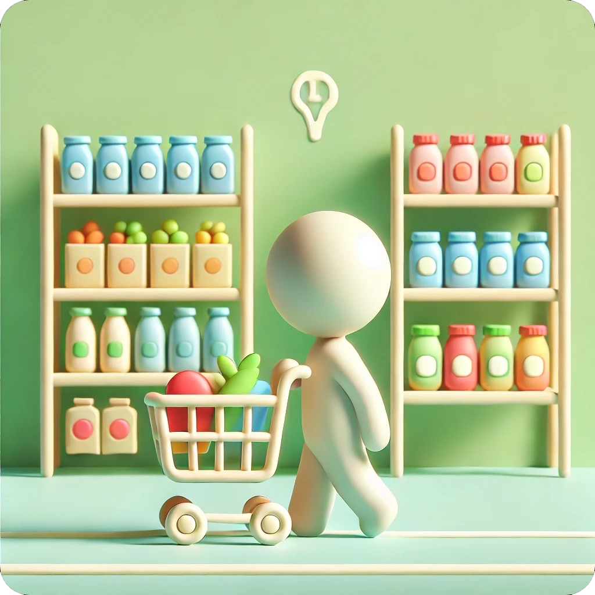
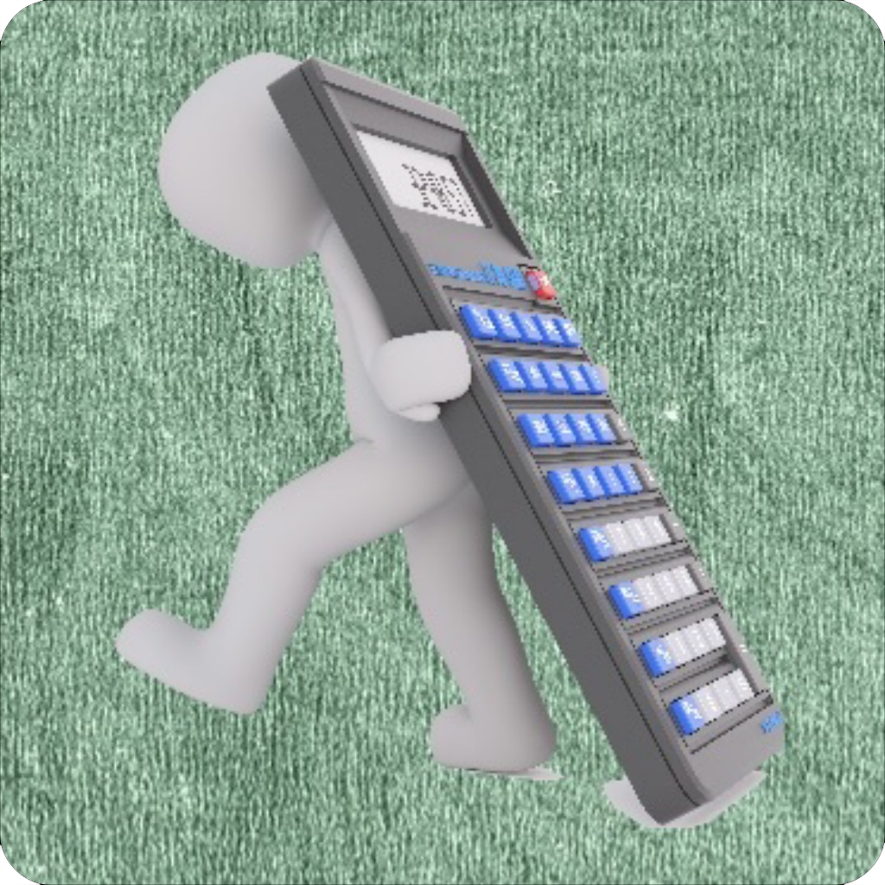
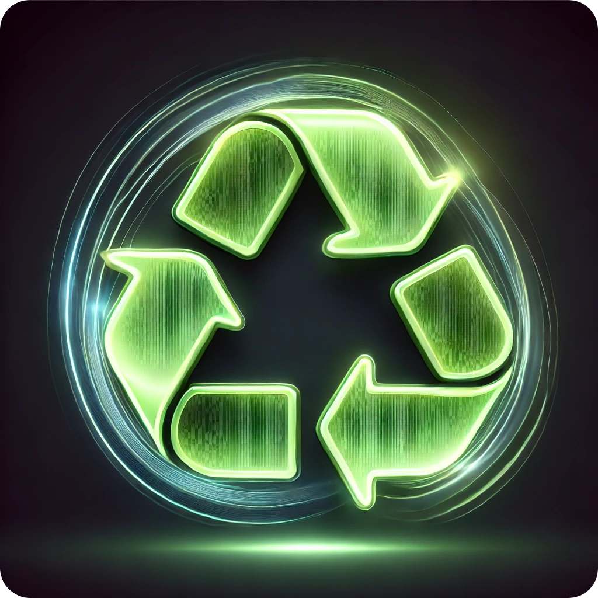
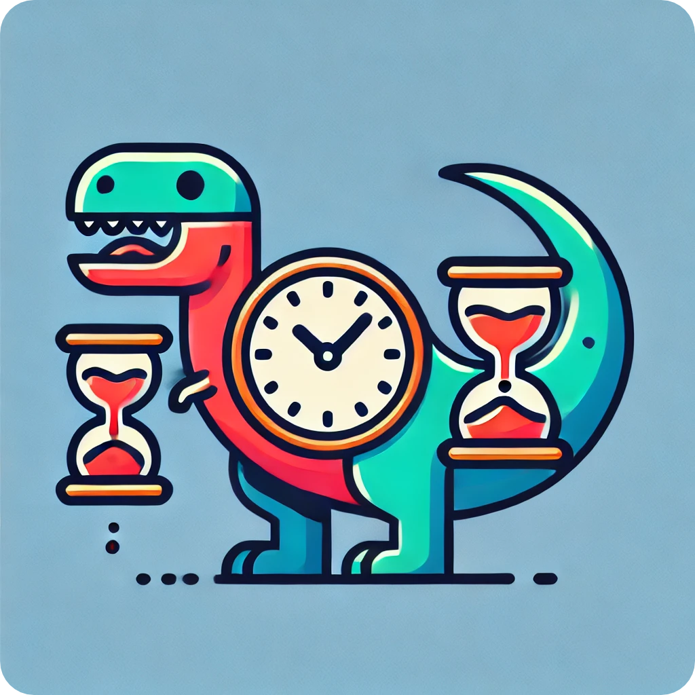

# Nikolai Nobadi
I’m an iOS developer focused on building modular apps that are easy to scale, test, and maintain. My goal is to write code that’s clean, flexible, and easy to return to, both for teammates and for my future self.

I prioritize readability and test coverage to ensure that changes can be made confidently. The question I ask myself constantly is: will I understand this code in five months without needing to retrace every step? If not, it's time to refactor.

Lately, I’ve been branching out into macOS development and command-line tools. I’m also extracting specific modules from my App Store apps and making them public to showcase how I approach architecture, testing, and scalable system design.

### 🛠️ Languages & Tools


<br />
<br />

---

###  Available on the App **Store**

<div style="display: flex; align-items: center;">
  <a href="https://apps.apple.com/app/icleanme/id1350310256">
    
  </a>
  &nbsp;&nbsp;&nbsp;
  <a href="https://apps.apple.com/us/app/igetgroceries/id1578530983">
    
  </a>
  &nbsp;&nbsp;&nbsp;
  <a href="https://apps.apple.com/app/ioweyou-debt-tracker/id6450847298">
    
  </a>
  &nbsp;&nbsp;&nbsp;
  <a href="https://apps.apple.com/us/app/iaddthree/id1389962750">
    
  </a>
  &nbsp;&nbsp;&nbsp;
  <a href="https://apps.apple.com/us/app/codepurge/id6740788205?mt=12">
    
  </a>
  &nbsp;&nbsp;&nbsp;
  <a href="https://apps.apple.com/us/app/hoursaurus/id6743008502">
    
  </a>
</div>

###  Available on **TestFlight**

<div style="display: flex; align-items: center;">
  <a href="https://testflight.apple.com/join/RZ4TSPUX">
    
  </a>
</div>


---

### 🍺 Available on **Homebrew**

- **nnex**: A command-line tool to manage swift executables and streamline distribution with Homebrew
- **nnapp**: A project launcher CLI for organizing and managing your Swift/Xcode projects.

```bash
brew tap nikolainobadi/nntools
brew install nnex
brew install nnapp
```
